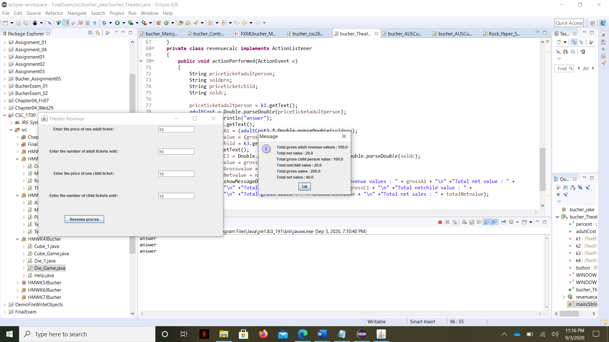

I used javascript on eclipse to produce this project.

The code I used was:

import javax.swing.*;
import java.awt.*;
import java.awt.event.*;

public class Theater extends JFrame{
	
	final double percent = .20;
    double adultCost;
    private JTextField k1;
    private JTextField k2;
    private JTextField k3;
    private JTextField k4;
    private JButton button;
    private final int WINDOW_WIDTH = 600;
    private final int WINDOW_HEIGHT = 400;
    
    public Theater() {
    	setTitle("Theater Revenue");
        setSize(WINDOW_WIDTH, WINDOW_HEIGHT);
        setDefaultCloseOperation(JFrame.EXIT_ON_CLOSE);
        setLayout(new GridLayout(5,2));
        button = new JButton("Revenue procss");
        button.addActionListener(new revenuecalc());

        JLabel label1 = new JLabel("Enter the price of one adult ticket : ");
        k1 = new JTextField(10);
        JLabel label3 = new JLabel("Enter the number of adult tickets sold : ");
        k2 = new JTextField(10);
        JLabel label5 = new JLabel("Enter the price of one child ticket : ");
        k3 = new JTextField(10);
        JLabel label7 = new JLabel("Enter the number of child tickets sold : ");
        k4 = new JTextField(10);

        JPanel p1 = new JPanel();
        JPanel p2 = new JPanel();
        JPanel p3 = new JPanel();
        JPanel p4 = new JPanel();
        JPanel p5 = new JPanel();
        JPanel p6 = new JPanel();
        JPanel p7 = new JPanel();
        JPanel p8 = new JPanel();
        JPanel p9 = new JPanel();

        p1.add(label1);
        p2.add(k1);
        p3.add(label3);
        p4.add(k2);
        p5.add(label5);
        p6.add(k3);
        p7.add(label7);
        p8.add(k4);
        p9.add(button);
        
        add(p1);
        add(p2);
        add(p3);
        add(p4);
        add(p5);
        add(p6);
        add(p7);
        add(p8);
        add(p9);
        setVisible(true);
        
    }
    private class revenuecalc implements ActionListener
    {
    	public void actionPerformed(ActionEvent e)
        {
            String priceticketadultperson;
            String soldpro;
            String priceticketchild;
            String soldc;
          
            priceticketadultperson = k1.getText();
            adultCost = Double.parseDouble(priceticketadultperson);
            System.out.println("answer");
            soldpro = k2.getText();
            double grossA1 = (adultCost) * Double.parseDouble(soldpro);
            double netAvalue = (grossA1) * percent;
            priceticketchild = k3.getText();
            soldc = k4.getText();
            double grossC1 = Double.parseDouble(priceticketchild)* Double.parseDouble(soldc);
            double netCvalue = grossC1 * percent;
            double totalGrossvalue = grossC1+grossA1;
            double totalNetvalue = netAvalue+netCvalue;
            JOptionPane.showMessageDialog(null, "Total gross adult revenue values : " + grossA1 + "\n" +"Total net value : " +
            netAvalue + "\n" +"Total gross child person value : " + grossC1 + "\n" +"Total netchild value : " +
            netCvalue + "\n" +"Total gross sales : " + totalGrossvalue + "\n" +"Total net sales : " + totalNetvalue);
    }
    }
    
    public static void main(String[] args) {
    	Theater theatre = new Theater();
	}

}
